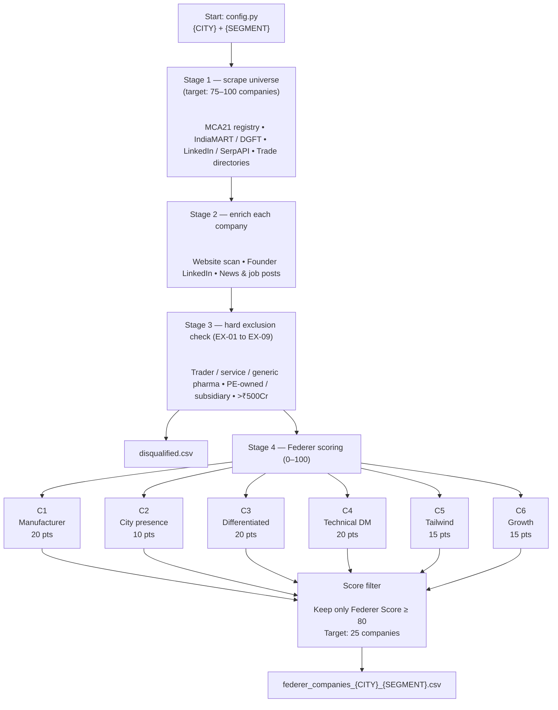
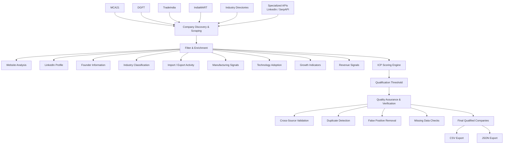

# DT

Scraped the list of companies by creating my own scraper , only 6 of them could qualify for greater than 65 score in Basket B types companies , currently not included LinkedIn (via SerpAPI) and others which requires specialized APIs.

Note : it may take a few seconds for the diagrams to load

Basic architecture 

Question 2: The 1000-Company Proposal

Approach to building a list of ICP-qualified companies would combine automated scraping, data enrichment, scoring, and verification. First, I would collect a large company universe from MCA21, DGFT, TradeIndia, IndiaMART, industry directories, and other publicly available databases, while also using specialized APIs where available. The scraper would gather company names, websites, locations, and industry information. Next each company would be enriched using website analysis, LinkedIn data, founder profiles, and business directories. Key qualification signals would include industry relevance, manufacturing activity, import/export presence, technology adoption, growth indicators, and revenue signals. These attributes would be converted into an ICP score based on the target profile requirements. Companies above the qualification threshold would move to the verification stage. Quality assurance would be performed by cross-checking data across multiple sources to reduce false positives and missing information. The process would run iteratively, refining scoring rules whenever verification reveals classification errors. The final output would be a verified dataset of approximately 1,000 ICP-qualified companies exported in CSV and JSON formats.

