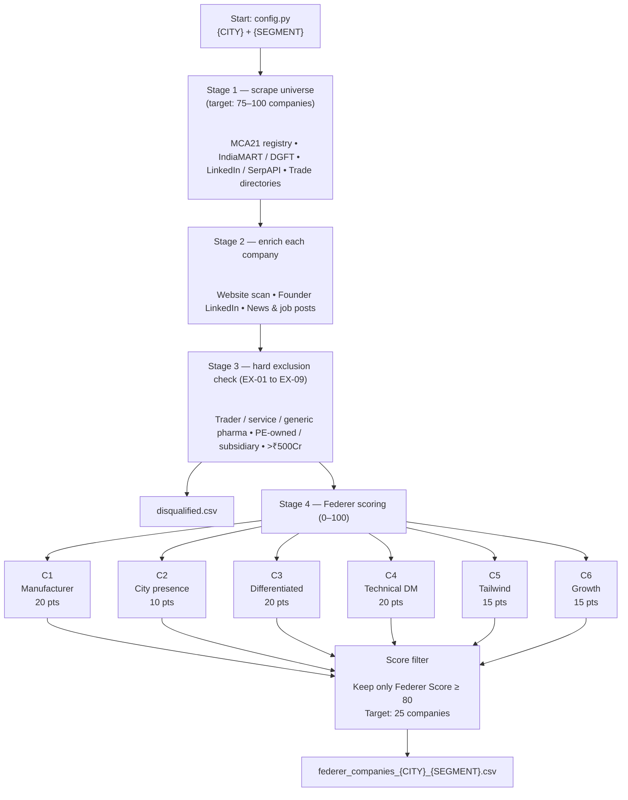

# DT

Scraped the list of companies by creating my own scraper , only 6 of them could qualify for greater than 65 score in Basket B types companies , currently not included LinkedIn (via SerpAPI) and others which requires specialized APIs.

Basic architecture 

